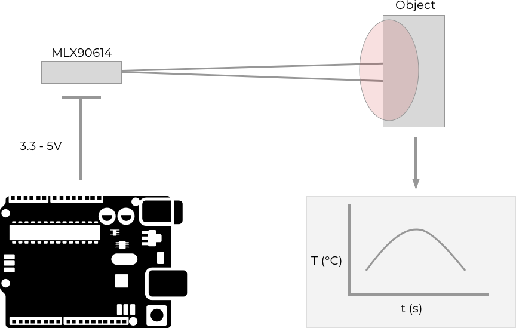

.. mlx90614 documentation master file, created by
   sphinx-quickstart on Mon Jun 25 11:12:35 2018.
   You can adapt this file completely to your liking, but it should at least
   contain the root `toctree` directive.

Drivers for MLX90614 Long-range Infrared Sensor
===============================================

These drivers support the `MLX90614 Single and Dual Zone Infrared Thermometer <http://cpre.kmutnb.ac.th/esl/learning/mlx90614_infrared_thermometer/MLX90614_Datasheet.pdf>`_.

This is a long-range infrared camera that can measure temperatures between -70 °C and 380 °C with an accuracy of 0.5 °C.

.. toctree::
   :maxdepth: 2
   :caption: Contents:

Prerequisites
-------------

- Linux device with an MLX90614 connected via I2C, such as any version of `Forward Loop Zero <https://forward-loop.com/developer.html>`_ with the optional long-range infrared.
- (Optional) Docker on the Linux device. We recommend you check out `floop <https://github.com/ForwardLoopLLC/floopcli>`_, our simple, open-source tool for working with embedded Docker on multiple devices at the same time.

Install
-------

.. tabs::

    .. group-tab:: Using floop

        In order to use the drivers with floop, you configure the drivers and your application on a host device then push the source code and build instructions to each target device using floop.

        On your host, install floop using pip:

        .. code-block:: bash

            pip install --upgrade floopcli

        Clone the driver repository:
        
        .. code-block:: bash

            git clone --recursive https://github.com/ForwardLoopLLC/mlx90614

        The clone needs to be recursive in order to clone the appropriate `I2C drivers <https://github.com/ForwardLoopLLC/i2c>`_.

        Change directory into driver directory:

        .. code-block:: bash

            cd mlx90614

        Configure floop to allow access to I2C devices on the target device. For example, if you have one target device available over SSH at the address 192.168.1.100, your **floop.json** in the **mlx90614** directory could be:

        .. literalinclude:: ../../floop.json.example

        Notice that *privileged* is true, so floop has access to target device hardware.

        In order to check that installation succeeded, you can run the simple example included in the driver repository. You will need to tell the driver which bus holds the MLX90614. 
        
        Edit the file **run.sh.linux**:
        
        .. literalinclude:: ../../run.sh.linux
       
        Make sure to change the value of `BUS` to match the bus to which your MLX90614 is connected. The value of `BUS` is the same as the integer that corresponds to the `/dev/i2c-*` entry for your device.

        Now run the example:

        .. code-block:: bash

            floop run -v

        If the example returns with no error, then the installation succeeded. 

    .. group-tab:: Header Files 

        You can install the C++ header files for use in your own applications.  

        You need to install the MLX90614 and I2C headers, then include them during compilation of your application. Inside of your application folder, you can install both headers at the same time:

        .. code-block:: bash

            mkdir -p ./floop/i2c/ && \
            mkdir -p ./floop/mlx90614/ && \
            wget -O ./floop/i2c/i2c.h https://github.com/ForwardLoopLLC/i2c/blob/master/i2c/i2c.h && \
            wget -O ./floop/mlx90614/mlx90614.h https://github.com/ForwardLoopLLC/mlx90614/blob/master/mlx90614/mlx90614.h

        When you compile your application, make sure to include the path to the driver headers. For example, add `-I./floop/` during compilation. You can then access the drivers by including the mlx90614 header:

        .. code-block:: c++

            #include "mlx90614/mlx90614.h"

        Note that you can also use these steps to install the drivers inside of a Docker container.

Example
-------

The example shows the major functionality of the drivers.

.. literalinclude:: ../../example/main.cpp
    :language: c++

API Documentation
-----------------
:doc:`cpp/api`
    Driver interface for MLX90614

`Source Code <https://github.com/ForwardLoopLLc/mlx90614>`_
    Our MIT license lets you use, change, and sell the drivers for free
